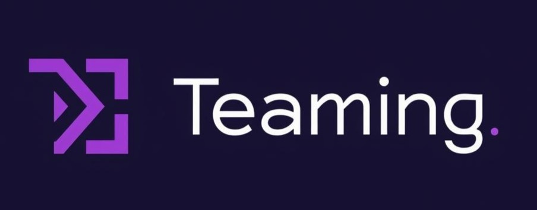

<!-- ================= HEADER ================= -->

  

---

<!-- ================= TECH STACK ================= -->
## ✨ Tech Stack ✨

<marquee behavior="scroll" direction="left" scrollamount="6">
  
</marquee>

---

<!-- ================= TOOLS ================= -->
## 🛠 Tools 🛠

  
  
  

---

<!-- ================= PROJECTS ================= -->
## 💼 Projects 💼

<!-- Project 1 -->
<table width="100%" align="center">
<tr>
<td align="center">

<table width="60%" align="center">
<tr>
<td align="center" valign="top">

  

### 🎯 **Teaming**
> 팀 협업 플랫폼

**Tech**  
Next.js · React · TypeScript · WebSocket · NextAuth  

**Features**  
🔴 실시간 채팅 &nbsp;|&nbsp; 📌 과제 관리 &nbsp;|&nbsp; 💳 결제 시스템  

</td>
</tr>
</table>

</td>
</tr>
</table>

  

<!-- Project 2 -->
<table width="100%" align="center">
<tr>
<td align="center">

<table width="80%" align="center">
<tr>
<td align="center" valign="top">

  

### 🏃 **RunnersHi**
> RPG 러닝 커뮤니티 앱

**Tech**  
React Native · TypeScript  

**Features**  
🎮 RPG 성장 시스템 &nbsp;|&nbsp; 🏆 러닝 미션 &nbsp;|&nbsp; 👥 커뮤니티  

</td>
</tr>
</table>

</td>
</tr>
</table>

---

<!-- ================= GITHUB STATS ================= -->
## 📊 GitHub Stats 📊

<picture>
  <source
    srcset="https://github-readme-stats.vercel.app/api?username=ByeongJu0411&theme=github_dark&show_icons=true&hide_border=true"
    media="(prefers-color-scheme: dark)"
  />
  
</picture>

 

---

### 🌟 *"매일 조금씩, 그러나 확실하게 성장하는 개발자"* 🌟

